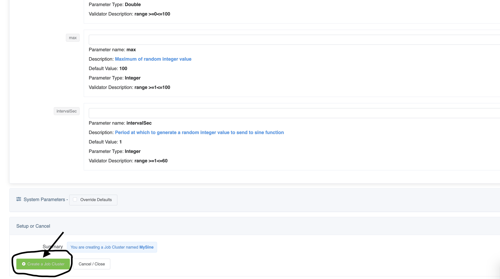
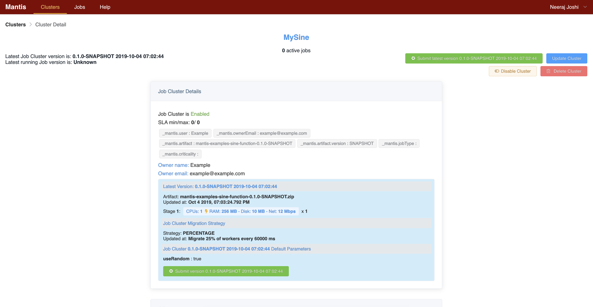

# Spinning up your first Mantis cluster using Docker

## Prerequisites

> Install [Docker for Mac](https://docs.docker.com/docker-for-mac/install/)

## Bootstraping your first Mantis Cluster in Docker

### Build a Docker image for Mantis Control Plane (Master)

Clone the Mantis Control Plane:

```bash
$ git clone https://github.com/Netflix/mantis-control-plane.git
```

```bash
$ cd mantis-control-plane/
$ ./buildDockerImage.sh
```

### Build Docker image for Mantis Worker 

Clone the main Mantis repository:

```bash
$ git clone https://github.com/Netflix/mantis.git

# Set an environment variable called MANTIS_INSTALL_DIR to the root of this project
$ export MANTIS_INSTALL_DIR=/Users/user/mantis
```
 
Clone the Mantis examples:

```bash
$ git clone https://github.com/Netflix/mantis-examples.git
```

```bash
# Create a sine-function artifact
$ cd mantis-examples/
$ ./gradlew clean mantis-examples-sine-function:mantisZipArtifact

# Copy to conf/ that is mounted on the mantis worker Docker image
$ cp sine-function/build/distributions/mantis-examples-sine-function-0.1.0-SNAPSHOT.zip <path to mantis repo>/localdev/conf/

# Build the Worker docker image
$ cd <path to mantis repo>/mantis-server/mantis-server-worker
$ ./buildDockerImage.sh
```

### Build Docker image for Mantis API

Clone the Mantis API project:
```bash
$ git clone https://github.com/Netflix/mantis-api.git
```
```bash
$ cd mantis-api/
$ ./buildDockerImage.sh
```

### Start the Mantis cluster

```bash
$ cd <path to mantis repo>
$ docker-compose -f docker-compose-new-master.yml up
```

This starts up the following Docker containers:

- Zookeeper
- Mesos Master
- Mantis Master
- Mantis API
- Mesos Slave and Mantis Worker run on a single container (mantisagent)

### Create and submit the sine-function Job Cluster via CLI

```bash
$ curl -X POST http://127.0.0.1:8100/api/namedjob/create --silent --data @$MANTIS_INSTALL_DIR/localdev/conf/namedJob-template -vvv

$ curl -X POST http://127.0.0.1:8100/api/submit --silent --data @$MANTIS_INSTALL_DIR/localdev/conf/submitJob-template -vvv
```

To get a shell on a running container:

```bash
$ docker exec -it mantis_mantisagent_1 bash

# Job logs can be found here.
$ cd /tmp/mesos_workdir/slaves/<frameworkid>/frameworks/MantisFramework/executors
```
### Using the Mantis UI

Clone the Mantis UI project:

```bash
$ git clone https://github.com/Netflix/mantis-ui.git
```

Run the following commands (in the root directory of this project) to get all dependencies installed and to start the server:

```bash
$ yarn
$ yarn serve
```

Once the node server is up it should print something like

```
 App running at:
 Local:   http://localhost:8080/
```

Point your browser to the above URL and fill out the Registration form as follows


1. **Name:** `Example`
2. **Email:** `example@example.com`
3. **Master Name:** `Example`
4. **Mantis API URL:** `http://localhost:7101`
5. **Mesos URL:** `http://localhost:5050`

Click on `Create`

The Mantis Admin page should have no Job clusters currently.


Create a new Job Cluster

Click on the `Create New Job Cluster` button on the top right.

Specify the cluster name as `MySine`

Click on `Upload file` and drag and drop the these two files

1. `mantis-examples/sine-function/build/distributions/mantis-examples-sine-function-0.1.0-SNAPSHOT.zip`
1. `mantis-examples/sine-function/build/distributions/mantis-examples-sine-function-0.1.0-SNAPSHOT.json`


Under the section `Stage 1 - Scheduling Information` click on `Edit` and reduce the Disk and Network requirements
for this worker to `10` and `12` respectively.


Under the section `Parameters` click on `Override Defaults`
Here you can override values for Job parameters. Let us override the parameter `useRandom` to `true`


Click `Create Job Cluster` on the bottom left



This will create the job cluster



Now let us submit a new Job for our Job Cluster
Click the `Submit` green button this will open up a submit screen that will allow you to override Resource configurations
as well as parameter values.
 


Let us skip all that and scroll directly to the bottom and hit the `Submit` button on the bottom left.


View output of the job

If all goes well your job would go into `Launched` state.


Scroll to the bottom and in the `Job Output` section click on `Start`

You should see output of the Sine function job being streamed below

```
Oct 4 2019, 03:55:39.338 PM - {"x": 26.000000, "y": 7.625585}
```


8. To teardown the Mantis cluster, issue the following command

```bash
$ cd <path to mantis repo>
$ docker-compose -f docker-compose-new-master.yml down
```
